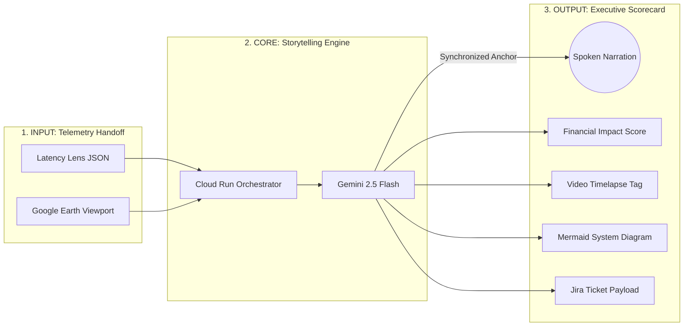

# Clarity Studio

**Phase 2 of the Autonomous Enterprise Suite** · AI Technical Storyteller & Creative Director

> Ingests raw network latency telemetry from [Phase 1: Latency Lens], transforms it into a real-time
> interleaved multimodal executive storyboard (spoken narration + Mermaid diagrams + financial
> scorecards + Jira execution payload), then hands off to [Phase 3: Circuit Stitcher].

---

## How it works

```
Phase 1: Latency Lens          Phase 2: Clarity Studio         Phase 3: Circuit Stitcher
─────────────────────          ───────────────────────         ─────────────────────────
Telemetry JSON          ──►    Cloud Run  ──►  Gemini 2.5 Flash  ──►  Jira Ticket payload
Google Earth viewport   ──►    (this repo)     Native Audio + Text
```

Gemini 2.5 Flash produces interleaved output — spoken PCM audio and structured text simultaneously —
across a 4-frame storyboard that plays out like a live executive briefing.

---

## Quick start (local)

### Prerequisites
- Python 3.11+
- A Gemini API key ([get one here](https://aistudio.google.com/))

### 1. Backend

```bash
cd backend
pip install -r requirements.txt
cp ../.env.example .env
# Edit .env and set GEMINI_API_KEY=your_key
uvicorn main:app --reload --port 8080
```

### 2. Frontend

Open `frontend/index.html` directly in any modern browser — no build step required.

Set the **Backend URL** field to `http://localhost:8080`.

### 3. Generate a briefing

1. Paste or edit the telemetry JSON in the left panel (a sample BGP route-flap incident is pre-loaded).
2. Optionally upload a **Google Earth viewport screenshot** of the fiber route — Gemini's vision model
   will reference the physical terrain in the narrative.
3. Select the target audience: **CTO**, **CFO**, or **CEO**.
4. Click **▶ Generate Briefing**.

---

## API

### `POST /generate-briefing`

Returns a Server-Sent Events stream.

```json
{
  "telemetry": {
    "severity": "CRITICAL",
    "expected_latency_ms": 45,
    "delta_ms": 312,
    "diagnosis_category": "BGP_ROUTE_FLAP",
    "origin": "us-west-2 (Oregon)",
    "destination": "eu-central-1 (Frankfurt)",
    "affected_services": ["payment-gateway", "order-service"],
    "timestamp": "2026-03-14T09:42:17Z"
  },
  "audience_type": "CTO",
  "viewport_image": {
    "mime_type": "image/jpeg",
    "data": "<base64-encoded screenshot>"
  }
}
```

`viewport_image` is optional. `audience_type` must be one of: `CFO`, `CTO`, `CEO`,
`VP Engineering`, `VP Finance`.

**SSE event types**

| type    | fields                        | description                                  |
|---------|-------------------------------|----------------------------------------------|
| `start` | `message`                     | Stream opened                                |
| `chunk` | `text`                        | Streaming text (markdown storyboard content) |
| `audio` | `data` (base64), `mime_type`  | Native PCM audio chunk from Gemini           |
| `error` | `message`                     | Generation or API error                      |
| `end`   | —                             | Stream complete                              |

### `GET /health`

```json
{"status": "ok", "version": "1.0.0"}
```

---

## Deploy to Google Cloud Run

```bash
export GCP_PROJECT_ID=your-project-id
export GEMINI_API_KEY=your-key   # only needed first run — stored in Secret Manager
bash deploy.sh
```

The script:
1. Creates a Secret Manager secret for the API key (first run only)
2. Deploys the backend with `gcloud run deploy --source ./backend`
3. Patches `frontend/index.html` with the live Cloud Run URL

---

## Architecture



---

## Tests

```bash
cd backend
python -m pytest tests/ -v
```

39 tests covering prompt building, input validation, SSE streaming, singleton client, and error paths.

---

## Project structure

```
clarity-studio/
├── backend/
│   ├── main.py          # FastAPI + SSE streaming endpoint
│   ├── prompt.py        # System persona + dynamic prompt builder
│   ├── requirements.txt
│   ├── Dockerfile
│   └── tests/
│       ├── test_prompt.py
│       └── test_main.py
├── frontend/
│   ├── index.html       # Executive Dashboard (no build step)
│   ├── app.js           # Stream parser · Mermaid renderer · Web Audio API
│   └── styles.css
├── deploy.sh
└── .env.example
```
