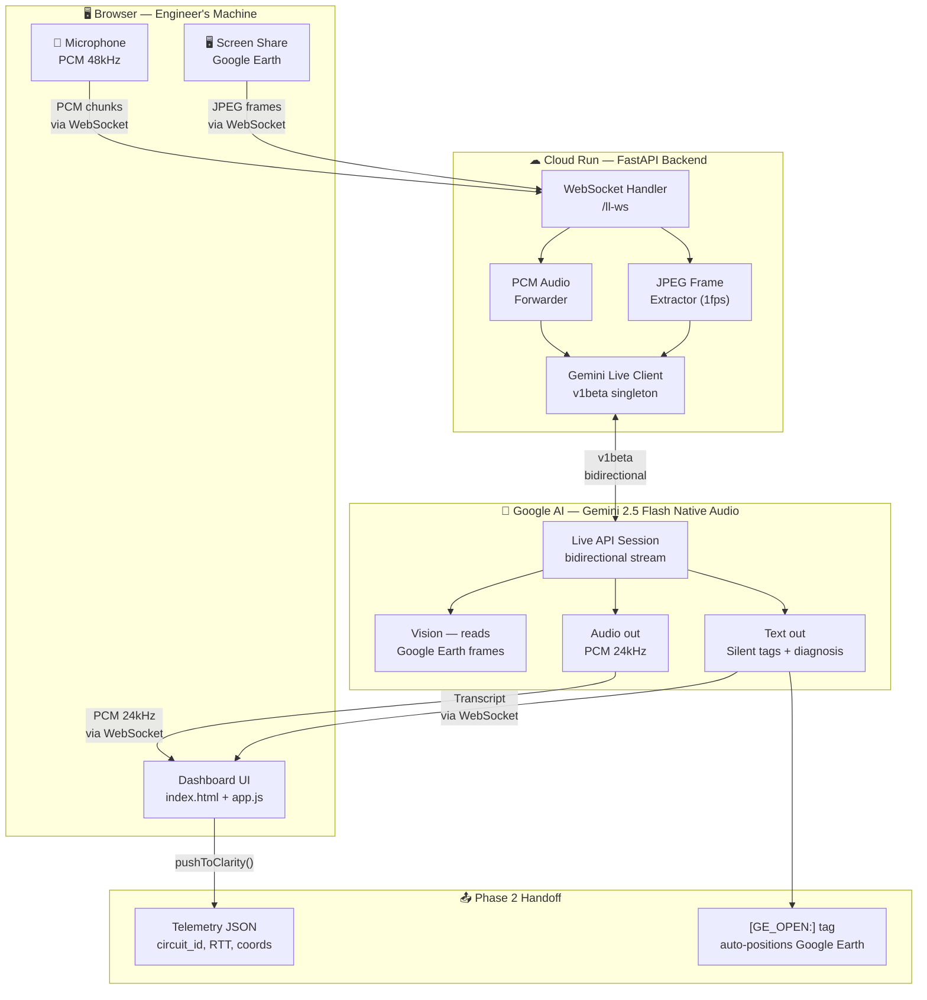

# Phase 1 — Latency Lens
### Autonomous Enterprise Suite · AI Network Diagnostics Agent

> A live multimodal AI voice agent that listens to engineers, watches Google Earth in real-time via screen share, and autonomously diagnoses fiber network latency anomalies — all in under 60 seconds.

---

## What it does

An engineer opens Google Earth showing a fiber route, starts a voice session, and describes their circuit.
Latency Lens:

1. **Hears** the circuit ID and telemetry (voice or typed)
2. **Watches the screen** — grabs 1 frame/second from the shared screen and sends it to Gemini vision
3. **Speaks the diagnosis** live — RTT math, severity (Green/Amber/Red), route violation detection
4. **Silently emits** `[GE_OPEN:]` navigation tags that auto-position Google Earth to the midpoint
5. **Pushes** a structured JSON handoff to Phase 2 (Situation Intelligence Brief)

---

## Q1 — Technologies

| Layer | Technology |
|---|---|
| **AI Model** | Gemini 2.5 Flash Native Audio (`gemini-2.5-flash-native-audio-preview-12-2025`) |
| **AI API** | Google Gemini Live API — bidirectional real-time audio + vision |
| **API Version** | `v1beta` (required for Live API) |
| **Backend** | Python 3.11, FastAPI, Uvicorn |
| **Backend SDK** | `google-genai >= 1.16` |
| **Transport** | WebSocket (bidirectional audio streaming) |
| **Audio Capture** | Web Audio API, AudioWorklet, PCM 48kHz → 16kHz resampling |
| **Screen Capture** | `getDisplayMedia()`, `ImageCapture API`, JPEG frame extraction at 1fps |
| **Frontend** | Vanilla HTML5/CSS3/JavaScript — zero build step |
| **Deployment** | Google Cloud Run (containerised, `--source` build) |
| **Secrets** | Google Cloud Secret Manager |
| **Simulation** | Google Earth Web Embed (requires Maps Platform billing — screenshot placeholder used) |
| **Diagrams** | Mermaid.js v11 |

**Google Cloud services used:**
- Gemini API (Google AI Studio / Vertex AI compatible)
- Cloud Run (hosting)
- Cloud Secret Manager (API key storage)

---

## Q2 — Links

| Resource | URL |
|---|---|
| **GitHub** | _[add repo URL here]_ |
| **Live Demo** | _[add Cloud Run URL after `bash deploy.sh`]_ |
| **Demo Video** | _[add recording link]_ |
| **Try locally** | See **Q5 — Testing** below |

> **Is the webhost externally accessible?**
> Yes — `deploy.sh` deploys to Google Cloud Run with `--allow-unauthenticated`. Once deployed, the URL is publicly accessible. The frontend is a static HTML file served from the same Cloud Run container — no separate hosting needed.

---

## Q3 — Architectural Diagram



---

## Q4 — Public Code Repository

**GitHub:** _[add URL — e.g. `https://github.com/your-org/clarity-studio`]_

Key files for Phase 1:
- [`backend/main.py`](backend/main.py) — WebSocket handler, Gemini Live session management
- [`backend/prompt.py`](backend/prompt.py) — `LL_SYSTEM_PROMPT`, latency math, swarm narration rules
- [`frontend/app.js`](frontend/app.js) — Audio worklet, screen frame capture, GE tag parser
- [`frontend/index.html`](frontend/index.html) — Phase 1 UI panel

---

## Q5 — Reproducible Testing

### Prerequisites
- Python 3.11+
- Node.js (for JS syntax check in tests)
- A [Gemini API key](https://aistudio.google.com/) with Live API access

### 1. Clone & install

```bash
git clone <repo-url>
cd clarity-studio/backend
pip install -r requirements.txt
```

### 2. Configure

```bash
cp ../.env.example .env
# Open .env and set:
# GEMINI_API_KEY=AIza...
```

### 3. Run the server

```bash
uvicorn main:app --port 8080
# Server starts at http://localhost:8080
# Frontend served at http://localhost:8080 (static files)
```

### 4. Open the app

Open `http://localhost:8080` in Chrome (required for `getDisplayMedia` + Web Audio API).

### 5. Test Phase 1 manually

1. Click **Phase 1 · Latency Lens** tab
2. Enter your API key in the top-right field
3. Click **▶ Start Session** — browser will ask for microphone permission
4. Click **🖥 Share Screen** — share your Google Earth or any window
5. Say: *"Circuit C2891-W-SFO-PHX, expected latency 11.1ms, measured 15.2ms"*
6. Agent responds with live voice diagnosis and route analysis

### 6. Run automated tests

```bash
cd backend
python -m pytest tests/ -v

# Phase 1 specific tests:
python -m pytest tests/test_ll_websocket.py -v   # Live API WebSocket tests
python -m pytest tests/test_configs.py -v         # Singleton client config tests
python -m pytest tests/test_frontend.py -v        # Frontend structure smoke tests
```

### Expected test output
```
tests/test_ll_websocket.py::TestLLWebSocket::test_session_connect  PASSED
tests/test_configs.py::TestGeminiClients::test_ll_client_uses_v1beta  PASSED
tests/test_frontend.py::TestRequiredFunctions::test_switch_phase_defined  PASSED
... (39 tests total)
```

---

## Q6 — Google Cloud Deployment Proof

### Deploy script (Cloud Run + Secret Manager)

```bash
export GCP_PROJECT_ID=your-project-id
export GEMINI_API_KEY=AIza...   # first run only — stored in Secret Manager
bash deploy.sh
```

The script ([`deploy.sh`](deploy.sh)):
1. Creates a **Cloud Secret Manager** secret for `GEMINI_API_KEY`
2. Deploys to **Cloud Run** via `gcloud run deploy --source ./backend`
3. Sets memory (512Mi), CPU (1), timeout (300s), port (8080)
4. Patches `frontend/index.html` with the live Cloud Run service URL

### Code evidence of Google Cloud usage

| File | Line | GCP Service |
|---|---|---|
| [`deploy.sh:34`](deploy.sh) | `gcloud secrets create` | Cloud Secret Manager |
| [`deploy.sh:45`](deploy.sh) | `gcloud run deploy --source` | Cloud Run (source build) |
| [`deploy.sh:51`](deploy.sh) | `--set-secrets=GEMINI_API_KEY` | Secret Manager → Cloud Run env |
| [`backend/main.py`](backend/main.py) | `from google import genai` | Gemini API (Google AI) |
| [`backend/main.py`](backend/main.py) | `genai.Client(http_options={"api_version": "v1beta"})` | Gemini Live API |
| [`backend/Dockerfile`](backend/Dockerfile) | `EXPOSE 8080` | Cloud Run container spec |

### Health check (once deployed)

```bash
curl https://YOUR-CLOUD-RUN-URL/health
# {"status": "ok", "version": "1.0.0"}
```
