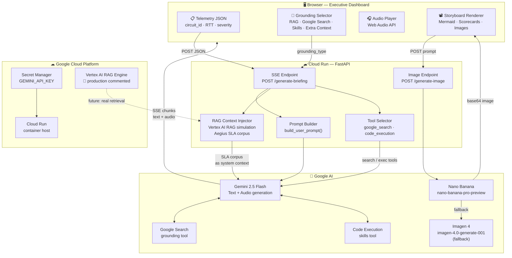

# Phase 2 — Situation Intelligence Brief
### Autonomous Enterprise Suite · AI Executive Storyteller

> Transforms raw network telemetry into a live multimodal executive storyboard — spoken narration, Mermaid architecture diagrams, financial scorecards, and AI-generated slide illustrations — delivered in under 10 seconds.

---

## What it does

Takes the JSON handoff from Latency Lens (or manually entered telemetry) and generates a 4-frame executive briefing:

| Frame | Content |
|---|---|
| **1 — Observation** | Video timelapse tag · spoken summary · Google Earth navigation |
| **2 — Explanation** | Live Mermaid diagram (expected vs. actual fiber path) · AI-generated illustration |
| **3 — Implication** | Financial scorecard · RED/AMBER/GREEN severity · exposure estimate |
| **4 — Execution** | Jira ticket payload · circuit ID · recommended action steps |

Grounding sources selectable per briefing: **RAG** (Aegius SLA corpus), **Google Search**, **Skills** (code execution), or **Extra Context**.

---

## Q1 — Technologies

| Layer | Technology |
|---|---|
| **AI Model** | Gemini 2.5 Flash (`gemini-2.5-flash`) |
| **AI API** | Gemini generateContent — streaming SSE |
| **Grounding: RAG** | Vertex AI RAG Engine _(simulated — see below)_ |
| **Grounding: Search** | Gemini built-in `google_search` tool |
| **Grounding: Skills** | Gemini `code_execution` tool |
| **Image Generation** | `nano-banana-pro-preview` → `gemini-2.5-flash-image` → `gemini-3.1-flash-image-preview` → `imagen-4.0-generate-001` (fallback chain) |
| **Backend** | Python 3.11, FastAPI, Uvicorn |
| **Streaming** | Server-Sent Events (SSE) via `sse-starlette` |
| **Backend SDK** | `google-genai >= 1.16` |
| **Frontend** | Vanilla HTML5/CSS3/JavaScript — zero build step |
| **Diagrams** | Mermaid.js v11 (rendered client-side) |
| **Deployment** | Google Cloud Run |
| **Secrets** | Google Cloud Secret Manager |
| **RAG Simulation** | Aegius Benchmarking SLA corpus injected as system context |

**Google Cloud services used:**
- Gemini API (text generation + image generation)
- Vertex AI RAG Engine _(commented production code in `backend/main.py`)_
- Cloud Run + Cloud Secret Manager

### RAG simulation note
The Vertex AI RAG Engine integration is **simulated** — production code is commented in `backend/main.py::stream_gemini()`. The `HARDCODED_SLA_DOC` (Aegius Benchmarking SLAs) is injected directly into the system prompt, which is functionally equivalent to what a top-k retriever would return from a real corpus.

---

## Q2 — Links

| Resource | URL |
|---|---|
| **GitHub** | _[add repo URL here]_ |
| **Live Demo** | _[add Cloud Run URL after `bash deploy.sh`]_ |
| **Demo Video** | _[add recording link]_ |
| **Try locally** | See **Q5 — Testing** below |

> **Is the webhost externally accessible?**
> Yes — deploys to Google Cloud Run (`--allow-unauthenticated`). The frontend is a static HTML file served from the same Cloud Run service. The `/generate-briefing` SSE endpoint and `/generate-image` endpoint are both publicly reachable.

---

## Q3 — Architectural Diagram



---

## Q4 — Public Code Repository

**GitHub:** _[add URL — e.g. `https://github.com/your-org/clarity-studio`]_

Key files for Phase 2:
- [`backend/main.py`](backend/main.py) — `/generate-briefing` SSE endpoint, `stream_gemini()`, Vertex AI RAG commented code, `/generate-image` 6-model fallback chain
- [`backend/prompt.py`](backend/prompt.py) — `SYSTEM_PROMPT`, `CS_MODEL`, `build_user_prompt()`, `HARDCODED_SLA_DOC`
- [`frontend/app.js`](frontend/app.js) — `startBriefing()`, `csProcessLine()`, `csRenderMermaid()`, `_nanoBananaFetch()`, `csGroundingType`
- [`frontend/index.html`](frontend/index.html) — Phase 2 panel, grounding selector, storyboard output area

---

## Q5 — Reproducible Testing

### Prerequisites
- Python 3.11+
- Node.js (for JS syntax tests)
- [Gemini API key](https://aistudio.google.com/)

### 1. Install

```bash
git clone <repo-url>
cd clarity-studio/backend
pip install -r requirements.txt
cp ../.env.example .env
# Set GEMINI_API_KEY in .env
```

### 2. Run

```bash
uvicorn main:app --port 8080
```

Open `http://localhost:8080` → click **Phase 2 · Situation Intelligence Brief**

### 3. Manual test — briefing generation

1. Enter your API key in the top-right header field
2. The telemetry payload is pre-loaded (C2891-W-SFO-PHX CRITICAL)
3. **Grounding Source** defaults to `📄 RAG · SLA Document` (Aegius corpus)
4. Select audience: **CTO**, **CFO**, or **CEO**
5. Click **▶ Generate Briefing**
6. Watch the 4-frame storyboard build live with audio narration

### 4. Test grounding sources

| Selection | Expected behaviour |
|---|---|
| `📄 RAG · SLA Document` | Briefing references Aegius SLA targets ($14,056/min, <10min audit) |
| `🔍 Google Search` | Gemini queries live web data during generation |
| `⚙️ Skills · Code Exec` | Gemini may run Python to calculate financial exposure |
| `📎 Extra Context` | Paste any runbook — model references it in the briefing |

### 5. Run automated tests

```bash
cd backend
python -m pytest tests/ -v

# Phase 2 specific:
python -m pytest tests/test_main.py -v         # /generate-briefing endpoint
python -m pytest tests/test_prompt.py -v       # prompt builder
python -m pytest tests/test_frontend.py -v     # storyboard JS functions
```

### 6. Test the image generation endpoint directly

```bash
curl -X POST http://localhost:8080/generate-image \
  -H "Content-Type: application/json" \
  -d '{
    "prompt": "Professional executive briefing slide: fiber network route map, dark aesthetic",
    "api_key": "YOUR_KEY"
  }'
# Returns: {"image": "<base64>", "mime_type": "image/jpeg"}
```

### 7. List available models (debug)

```bash
curl "http://localhost:8080/list-models?api_key=YOUR_KEY"
# Returns all models available under your API key subscription
```

---

## Q6 — Google Cloud Deployment Proof

### Deploy

```bash
export GCP_PROJECT_ID=your-project-id
export GEMINI_API_KEY=AIza...
bash deploy.sh
```

### Code evidence of Google Cloud usage

| File | What it does | GCP Service |
|---|---|---|
| [`deploy.sh:34`](deploy.sh) | `gcloud secrets create GEMINI_API_KEY_SECRET` | Cloud Secret Manager |
| [`deploy.sh:45-57`](deploy.sh) | `gcloud run deploy --source ./backend` | Cloud Run |
| [`deploy.sh:51`](deploy.sh) | `--set-secrets=GEMINI_API_KEY=...` | Secret → Cloud Run env |
| [`backend/main.py`](backend/main.py) | `client.models.generate_content_stream(model="gemini-2.5-flash")` | Gemini API |
| [`backend/main.py`](backend/main.py) | `client.models.generate_content(model="nano-banana-pro-preview")` | Gemini Image Gen |
| [`backend/main.py`](backend/main.py) | `client.models.generate_images(model="imagen-4.0-generate-001")` | Imagen 4 API |
| [`backend/main.py`](backend/main.py) | Vertex AI RAG commented block | Vertex AI RAG Engine |

### Vertex AI RAG production code (commented in `backend/main.py`)

```python
# from vertexai.preview.rag import RagCorpora, RagRetrieval
# from vertexai import init as vertex_init
# import vertexai.preview.generative_models as vertex_models
#
# vertex_init(project="your-gcp-project", location="us-central1")
# retrieval = RagRetrieval(
#     source=RagCorpora(rag_corpus="projects/.../ragCorpora/aegius-sla-corpus"),
#     similarity_top_k=5,
# )
# rag_tool = vertex_models.Tool.from_retrieval(retrieval)
```
> Full commented code at `backend/main.py` in `stream_gemini()` under `# SIMULATION: Vertex AI RAG Engine`
