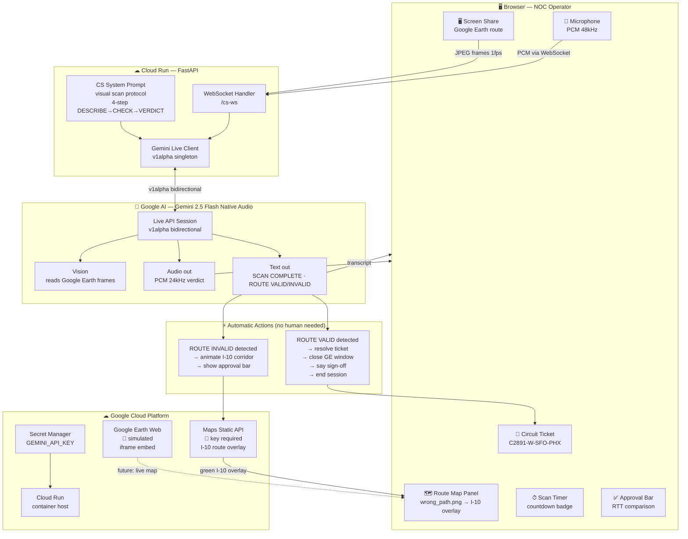

# Phase 3 — Circuit Stitcher
### Autonomous Enterprise Suite · AI Route Validation Agent

> A live multimodal AI voice agent that watches a fiber route on Google Earth via screen share, autonomously validates whether the route is correct or violating a prohibited zone, suggests the approved reroute, and closes the ticket when confirmed — all hands-free.

---

## What it does

Receives the Jira ticket and circuit coordinates from Phase 2, then:

1. **Shows** the current (wrong) route on a map — Sierra Nevada violation
2. **Asks** the user to open Google Earth and share their screen
3. **Watches** the screen (1 frame/second) and validates the route visually using Gemini vision
4. **Announces** the verdict live: `SCAN COMPLETE. ROUTE INVALID.` or `ROUTE VALID.`
5. **On INVALID** — animates the approved I-10 Southern Corridor as a green overlay
6. **Shows** an approval bar with RTT comparison (old vs. new route)
7. **On VALID** — says *"Ending session — the route is good"*, closes Google Earth, marks ticket **Resolved**, ends session automatically

---

## Q1 — Technologies

| Layer | Technology |
|---|---|
| **AI Model** | Gemini 2.5 Flash Native Audio (`gemini-2.5-flash-native-audio-preview-12-2025`) |
| **AI API** | Gemini Live API — bidirectional real-time audio + vision |
| **API Version** | `v1alpha` (required for multimodal Live sessions) |
| **Backend** | Python 3.11, FastAPI, Uvicorn |
| **Backend SDK** | `google-genai >= 1.16` |
| **Transport** | WebSocket (bidirectional audio + frame streaming) |
| **Audio Capture** | Web Audio API, AudioWorklet, PCM 48kHz → 16kHz resampling |
| **Screen Capture** | `getDisplayMedia()`, `ImageCapture API`, JPEG at 1fps |
| **Route Visualisation** | Google Maps Static API (optional, requires key) |
| **Frontend** | Vanilla HTML5/CSS3/JavaScript — zero build step |
| **Deployment** | Google Cloud Run |
| **Secrets** | Google Cloud Secret Manager |
| **Simulation** | Google Earth Web Embed (requires Maps Platform billing) · `wrong_path.png` placeholder used |

**Google Cloud services used:**
- Gemini Live API (Google AI)
- Google Maps Static API _(requires API key with Maps Platform billing)_
- Cloud Run + Cloud Secret Manager

### Google Earth simulation note
The route map uses a pre-rendered screenshot (`wrong_path.png`) as a stand-in for a live Google Earth Web Embed. The real implementation (commented in `app.js::cs3RenderRouteMap`) uses an `<iframe>` pointing to `earth.google.com/web/...` and requires Maps Platform billing + Earth API access.

---

## Q2 — Links

| Resource | URL |
|---|---|
| **GitHub** | _[add repo URL here]_ |
| **Live Demo** | _[add Cloud Run URL after `bash deploy.sh`]_ |
| **Demo Video** | _[add recording link]_ |
| **Try locally** | See **Q5 — Testing** below |

> **Is the webhost externally accessible?**
> Yes — Google Cloud Run with `--allow-unauthenticated`. Phase 3 uses WebSockets which are fully supported on Cloud Run (HTTP/2 upgrade). The screen share and microphone are browser-side only — no audio data is stored server-side.

---

## Q3 — Architectural Diagram



---

## Q4 — Public Code Repository

**GitHub:** _[add URL — e.g. `https://github.com/your-org/clarity-studio`]_

Key files for Phase 3:
- [`backend/main.py`](backend/main.py) — `/cs-ws` WebSocket handler, `get_cs_config()` (v1alpha Live session)
- [`backend/prompt.py`](backend/prompt.py) — `CS_SYSTEM_PROMPT` (4-step scan protocol), `CS_MODEL`, `build_cs_system_prompt()` commented production version
- [`frontend/app.js`](frontend/app.js) — `cs3StartSession()`, `cs3SendFrame()`, `cs3CheckValidVerdict()`, `cs3AnimateI10Route()`, `_cs3ResolveTicket()`, `_cs3NotifyGeVisibility()`
- [`frontend/index.html`](frontend/index.html) — Phase 3 panel, route map, ticket card, approval bar

---

## Q5 — Reproducible Testing

### Prerequisites
- Python 3.11+
- Chrome browser (required for `getDisplayMedia` + `ImageCapture` API)
- [Gemini API key](https://aistudio.google.com/) with Live API access
- _(Optional)_ Google Maps Platform key for I-10 route overlay

### 1. Install & run

```bash
git clone <repo-url>
cd clarity-studio/backend
pip install -r requirements.txt
cp ../.env.example .env
# Set GEMINI_API_KEY in .env
uvicorn main:app --port 8080
```

Open `http://localhost:8080` in Chrome → click **Phase 3 · Circuit Stitcher**

### 2. Full end-to-end test (recommended path)

**The fastest way is to use the Phase 1 → 2 → 3 pipeline:**

1. Start in **Phase 1 · Latency Lens** — start session, say the circuit details
2. Agent will ask "push to Clarity Studio?" — confirm
3. Phase 2 auto-generates the briefing and shows a **➤ Push to Circuit Stitcher** button
4. Click it — Phase 3 opens with the ticket pre-populated

**Or test Phase 3 directly:**

1. Switch to **Phase 3 · Circuit Stitcher** tab
2. Enter API key
3. Click **▶ Start Session** — allow microphone access
4. Say: *"I have circuit C2891-W-SFO-PHX open in Google Earth"*
5. Click **🖥 Share Screen** — share the Google Earth window (or any window with a map)
6. Watch the **Screen · scan Xs** countdown badge
7. Agent describes what it sees, issues a verdict, triggers I-10 animation if INVALID

### 3. Verdict detection test

The agent emits `SCAN COMPLETE. ROUTE INVALID.` or `SCAN COMPLETE. ROUTE VALID.`

| Scenario | How to trigger | Expected result |
|---|---|---|
| Route Invalid | Share any window (agent sees non-I-10 path) | I-10 green overlay animates in, approval bar appears |
| Route Valid | Agent confirms southern corridor | Ticket → Resolved, GE closes, session ends in ~5s |
| No Google Earth | Start session without GE open | Agent says *"I cannot see Google Earth"* |

### 4. Run automated tests

```bash
cd backend
python -m pytest tests/ -v

# Phase 3 specific:
python -m pytest tests/test_cs_websocket.py -v   # Circuit Stitcher WS tests
python -m pytest tests/test_cs_actions.py -v     # Action tag parsing
python -m pytest tests/test_frontend.py::TestRequiredFunctions -v
```

### 5. Test the scan timer

Start screen share → watch the **Screen** badge in the left panel:
```
Screen · scan 10s → 9s → 8s ... → 0s → resets to 10s (scan fires)
```

### 6. Health check

```bash
curl http://localhost:8080/health
# {"status": "ok", "version": "1.0.0"}
```

---

## Q6 — Google Cloud Deployment Proof

### Deploy

```bash
export GCP_PROJECT_ID=your-project-id
export GEMINI_API_KEY=AIza...
bash deploy.sh
```

### Code evidence of Google Cloud usage

| File | What it does | GCP Service |
|---|---|---|
| [`deploy.sh:34`](deploy.sh) | `gcloud secrets create GEMINI_API_KEY_SECRET` | Cloud Secret Manager |
| [`deploy.sh:45-57`](deploy.sh) | `gcloud run deploy --source ./backend` | Cloud Run (source build) |
| [`backend/main.py`](backend/main.py) | `genai.Client(api_version="v1alpha")` | Gemini Live API |
| [`backend/main.py`](backend/main.py) | `LiveConnectConfig(response_modalities=["AUDIO"])` | Gemini Native Audio |
| [`frontend/app.js`](frontend/app.js) | `_staticMap(...)` → `maps.googleapis.com/maps/api/staticmap` | Maps Static API |
| [`frontend/app.js`](frontend/app.js) | Google Earth iframe (commented) | Maps Platform / Earth API |

### v1alpha Live session setup (in `backend/main.py`)

```python
def _cs_live_client_for_key(api_key):
    # v1alpha — required for Circuit Stitcher (gemini-2.0-flash-live-001, multimodal)
    return genai.Client(http_options={"api_version": "v1alpha"}, api_key=key)

def get_cs_config():
    return types.LiveConnectConfig(
        response_modalities=["AUDIO"],
        system_instruction=types.Content(
            parts=[types.Part.from_text(text=CS_SYSTEM_PROMPT)],
            role="user",
        ),
        ...
    )
```

### Google Earth production code (commented in `frontend/app.js`)

```javascript
// SIMULATION: Google Earth API (hardcoded screenshot)
// Production replacement — uncomment once API credentials are provisioned:
//   const iframe = document.createElement('iframe');
//   iframe.src = `https://earth.google.com/web/@${(lat1+lat2)/2},${(lon1+lon2)/2},0a,1800000d/embed`;
//   iframe.allow = 'xr-spatial-tracking';
//   iframe.style.cssText = 'position:absolute;inset:0;width:100%;height:100%;border:0;z-index:2';
//   mapDiv.appendChild(iframe);
```
> Full commented block in `frontend/app.js::cs3RenderRouteMap()`

---

## System overview — all three phases

```
Phase 1: Latency Lens          Phase 2: SIB                Phase 3: Circuit Stitcher
─────────────────────          ────────────────────────    ──────────────────────────
Engineer speaks     ──────►    Executive storyboard ──►   NOC validates route
Google Earth screen            RAG grounding               Google Earth screen share
Gemini Live v1beta             Gemini 2.5 Flash SSE        Gemini Live v1alpha
WebSocket audio                Server-Sent Events          WebSocket audio + vision
Telemetry JSON ─────────────► Multimodal briefing          Auto-resolves ticket
                               Image generation
```
